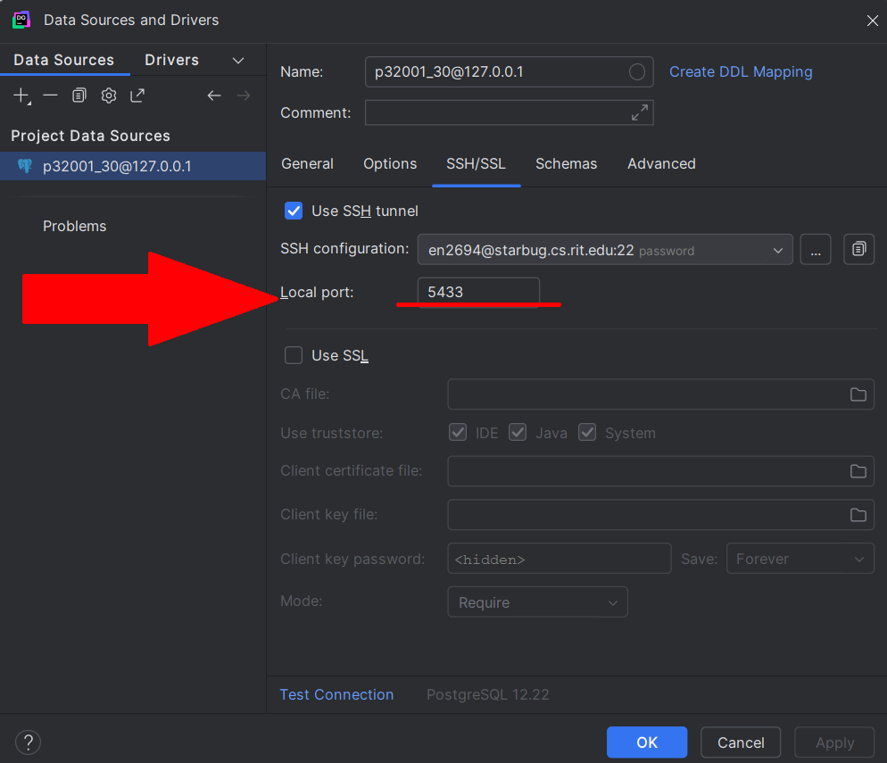

# MightyMusicalMusersApp
Interface for the MightMusicalMusers database
### File Overview
┣ 📂daos (data access objects CRUD)
┣ 📂docs (documents for programmers)
┣ 📂lib (required postgresql driver for JDBC)
┣ 📂models (POJOs for User,)

# Setup instructions
- Please use **JDK 23.0.2** to minimize any compatibility issues.
- <details>
    <summary>Please set the local port in DataGrip to 5433 for seamless integration, see image at the bottom.</summary> 

    - alternatively you may be able to  ssh outside of DataGrip, however this is untested:
    ```bat
        ssh -L 5433:127.0.0.1:5432 rituser@starbug.cs.rit.edu:22
    ```
    </details>
- Change the 'config.properties' file to use your school login to access DataGrip properly 
## Local Port Image Guide


just right click on the p32001_30\@127.0.0.1 and select properties